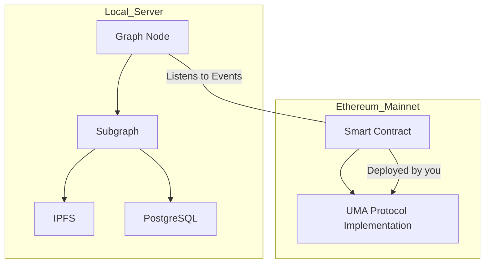

### The Graph Workflow

```mermaid
graph TD
    subgraph Local_Server
        direction TB
        A[Graph Node]
        B[Subgraph]
        C[IPFS]
        D[PostgreSQL]
        A --> B
        B --> D
        B --> C
    end

    subgraph Ethereum_Mainnet
        E[Smart Contract]
        F[UMA Protocol Implementation]
        E --> F
    end

    A ---|Listens to Events| E
    E -->|Deployed by you| F
```
